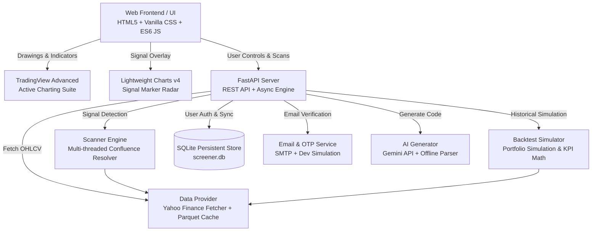

<div align="center">

# 📈 StrategyScreener & Backtester
### Real-Time Indian Stock Market (NSE & BSE) Multi-Strategy Screener, Backtesting Engine & TradingView Studio

[](https://tradingstratergyscreanner.ai.studio)
[](https://nodejs.org)
[](https://expressjs.com)
[](https://www.tradingview.com)
[](https://finance.yahoo.com)
[](LICENSE)

🌐 **[Open Live Website →](https://tradingstratergyscreanner.ai.studio)**

[**Explore Features**](#-key-features) • [**Live Architecture**](#-architecture--tech-stack) • [**Quickstart Guide**](#-quickstart-guide) • [**Strategy API Spec**](#-writing-custom-strategies)

</div>

---

## 🌟 Overview

**StrategyScreener & Backtester** is an open-source, full-stack quantitative trading platform built specifically for Indian Equities (**NSE & BSE**). It scans hundreds of benchmark and mid/small-cap equities simultaneously across user-defined Python trading algorithms, enforces **strict multi-strategy signal confluence**, and simulates portfolio performance with an interactive backtesting engine and the official **TradingView Advanced Real-Time Charting Suite**.

Whether you trade moving average crossovers, Supertrend breakouts, momentum sweeps, or complex multi-indicator price action models, this platform bridges the gap between Python algorithmic logic and an intuitive, responsive web UI.

---

## ⚡ Key Features

### 🔍 1. Multi-Strategy Confluence Screener
- **Directional Alignment**: Select 1, 2, or multiple strategies — the screener enforces strict confluence (all chosen strategies must output the same `BUY` or `SELL` signal).
- **Adjustable Lookback Tolerance (0–10 Bars)**: Allows signals that triggered within an $N$-candle window rather than strictly on the exact same bar.
- **Multi-Exchange Coverage**: Native support for both **NSE** (`.NS`) and **BSE** (`.BO`) tickers with smart suffix routing.

### 🌐 2. Expanded Multi-Select Stock Universes
- Select single or multiple market universes simultaneously:
  - **Nifty 50** & **Nifty Next 50**
  - **Nifty 100** & **Nifty 500**
  - **All NSE Stocks (500+ Liquid Equities)**
  - **BSE Sensex 30** & **All BSE Stocks (500+ Liquid Equities)**
  - **F&O Universe** (~184 Derivative Equities)
  - **Custom Watchlist** (Comma-separated ticker list or uploaded files)

### 📊 3. Dual-Engine TradingView Charting Studio
- **TradingView Advanced Real-Time Chart Suite**: Official embed with the full drawing toolbar (trendlines, rays, pitchforks, Fibonacci retracements, geometric brushes, text annotations) and 100+ native technical indicators.
- **Strategy Signal Radar**: High-performance candlestick and volume histogram view powered by Lightweight Charts with custom `BUY` (emerald arrow) and `SELL` (crimson arrow) strategy entry markers.
- **Cloud Drawing Persistence**: Save technical notes and chart annotations directly to your web account with 1-click cloud sync.

### 🧪 4. Quantitative Backtest Simulator
- Test strategies on historical data across any universe and timeframe (Daily, Hourly, 15m, 5m).
- **Portfolio Compounding & Money Management**: Configurable initial capital (₹), position sizing (% of capital), Stop Loss %, Take Profit %, opposite-signal exit rules, and maximum holding periods.
- **KPI Metrics Dashboard**:
  - Total Return % & Net Realized P&L (₹)
  - Win Rate % & Winning vs. Losing Trades count
  - Profit Factor (Gross Profits / Gross Losses)
  - Maximum Drawdown % & Peak-to-Trough Value (₹)
  - Average Trade Return %, Average Win % vs. Average Loss %
- **Interactive SVG Equity Curve**: Visualizes portfolio growth trajectory and drawdowns over time.
- **Filterable Trade Log & CSV Export**: Detailed ledger of every simulated trade with entry/exit dates, prices, realized return, and exit conditions.

### 🤖 5. AI Strategy Generator & In-Browser Code Editor
- **Natural Language to Python**: Describe your trading rule in plain English (e.g., *"Buy when 20 EMA crosses above 50 EMA and RSI is above 55. Sell when price closes below 20 EMA"*).
- **Dual AI Engine**: Uses **Google Gemini 2.5/3.0 API** when a key is provided, with an intelligent **offline rule-based AST generator** as an instant zero-configuration fallback.
- **Dynamic Hot-Reloading**: Create, edit, and upload `.py` files without ever restarting the backend server.

### 🔐 6. Secure Authentication & Email OTP System
- **User Accounts**: PBKDF2-HMAC-SHA256 password hashing with unique per-user cryptographic salts.
- **Email OTP Verification**: 6-digit one-time password dispatched for account activation and password resets.
- **Developer Local Preview**: Instant auto-detected OTP banner with 1-click auto-fill for frictionless local testing.
- **SMTP Production Ready**: Built-in SMTP settings (Gmail, SendGrid, Outlook, Amazon SES) with connection testing.

### ☁️ 7. Free Cloud Storage & Portable Backups
- Persistent SQLite database (`screener.db`) storing user accounts, custom strategies, chart drawings, and backtest records.
- **JSON Cloud Backup & Restore**: Download all your strategies and trade logs as a portable `.json` backup file or restore them to any browser with one click.

---

## 🏗️ Architecture & Tech Stack



| Layer | Technology | Purpose |
| :--- | :--- | :--- |
| **Backend** | Python 3.10+, FastAPI, Uvicorn | High-throughput asynchronous REST API |
| **Data Engine** | `yfinance`, Pandas, NumPy | OHLCV market feeds and vector calculations |
| **Data Caching**| Fast Parquet storage (`.cache/`) | Sub-millisecond candle cache to minimize network lag |
| **Database** | SQLite3 (WAL Mode) | Persistent user accounts, strategies, drawings, backtests |
| **Frontend** | Vanilla ES6+ JavaScript, Modern CSS | Zero-dependency, ultra-fast dual-theme (Dark/Light) UI |
| **Charts** | TradingView Advanced Widget + Lightweight Charts v4 | Professional technical analysis & custom markers |
| **AI / NLP** | Google Gemini API + Custom Regex Parser | Natural language strategy code synthesis |

---

## 🚀 Quickstart Guide

### Prerequisites
- Python 3.10 or higher installed ([python.org](https://www.python.org/downloads/))
- Git installed ([git-scm.com](https://git-scm.com/))

### 1. Clone the Repository
```bash
git clone https://github.com/<YOUR_USERNAME>/trading-strategy-screener.git
cd trading-strategy-screener
```

### 2. Install Dependencies
```bash
pip install -r requirements.txt
```

### 3. Launch the Application
```bash
python app.py
```
*(On Windows systems where Python is registered under the py launcher, use `py app.py`)*

### 4. Open in Your Browser
Navigate to **`http://localhost:8000`** 🎉

---

## 💻 Writing Custom Strategies

Every strategy in the platform is a standalone Python file stored inside the `strategies/` directory.

To create a new strategy, simply define a `calculate_signals(df)` function that receives a historical OHLCV DataFrame and returns a Pandas Series containing `'BUY'`, `'SELL'`, or `'HOLD'`:

```python
"""
strategies/my_custom_strategy.py
Example: 20 EMA & 50 EMA Trend Crossover with RSI Filter
"""
import pandas as pd
import numpy as np

def calculate_signals(df: pd.DataFrame) -> pd.Series:
    """
    Input DataFrame has columns: ['Open', 'High', 'Low', 'Close', 'Volume']
    Returns: pd.Series with 'BUY', 'SELL', or 'HOLD' indexed by timestamp
    """
    signals = pd.Series("HOLD", index=df.index)
    
    # Calculate 20 & 50 Exponential Moving Averages
    ema20 = df['Close'].ewm(span=20, adjust=False).mean()
    ema50 = df['Close'].ewm(span=50, adjust=False).mean()
    
    # Calculate 14-period RSI
    delta = df['Close'].diff()
    gain = (delta.where(delta > 0, 0)).rolling(window=14).mean()
    loss = (-delta.where(delta < 0, 0)).rolling(window=14).mean()
    rs = gain / loss
    rsi = 100 - (100 / (1 + rs))
    
    # Bullish condition: 20 EMA crosses above 50 EMA and RSI > 50
    buy_cond = (ema20 > ema50) & (ema20.shift(1) <= ema50.shift(1)) & (rsi > 50)
    
    # Bearish condition: 20 EMA crosses below 50 EMA and RSI < 50
    sell_cond = (ema20 < ema50) & (ema20.shift(1) >= ema50.shift(1)) & (rsi < 50)
    
    signals[buy_cond] = "BUY"
    signals[sell_cond] = "SELL"
    
    return signals
```

---

## ☁️ Live Deployment

This platform is live and publicly accessible at:

### 🌐 [https://tradingstratergyscreanner.ai.studio](https://tradingstratergyscreanner.ai.studio)

Published with instant updates and automatic HTTPS.

---

## 📡 REST API Reference

| Method | Endpoint | Description |
| :--- | :--- | :--- |
| `GET` | `/api/strategies` | Returns list of all loaded strategies with statuses |
| `GET` | `/api/strategy/{id}/code` | Fetches Python source code for an algorithm |
| `POST` | `/api/strategy/save` | Creates or updates a Python strategy file |
| `POST` | `/api/scan/start` | Initiates multi-threaded market scan |
| `GET` | `/api/scan/progress` | Polls active scan percentage and ticker status |
| `GET` | `/api/scan/results` | Retrieves final matching stocks and signal breakdown |
| `POST` | `/api/backtest/run` | Launches historical backtest simulation |
| `GET` | `/api/backtest/results` | Returns backtest KPIs, equity curve, and trade log |
| `POST` | `/api/auth/register` | Registers user and dispatches 6-digit email OTP |
| `POST` | `/api/auth/verify-otp` | Verifies email code and issues session JWT |
| `POST` | `/api/auth/login` | Authenticates user with username or email |
| `POST` | `/api/cloud/drawings/save`| Saves chart drawings and notes to user's account |
| `GET` | `/api/cloud/export` | Generates full portable JSON backup file |

---

## 🛡️ Security & Disclaimers

> **Disclaimer**: This software is intended solely for educational, research, and technical analysis purposes. It does **not** constitute financial, investment, or trading advice. Indian equities and derivatives carry financial risk. Always verify signals and conduct thorough risk management before committing real capital.

---

## 📄 License

Distributed under the **MIT License**. See [`LICENSE`](LICENSE) for more details.

<div align="center">
  <sub>Built with ❤️ for quantitative traders and Indian market enthusiasts.</sub>
</div>
